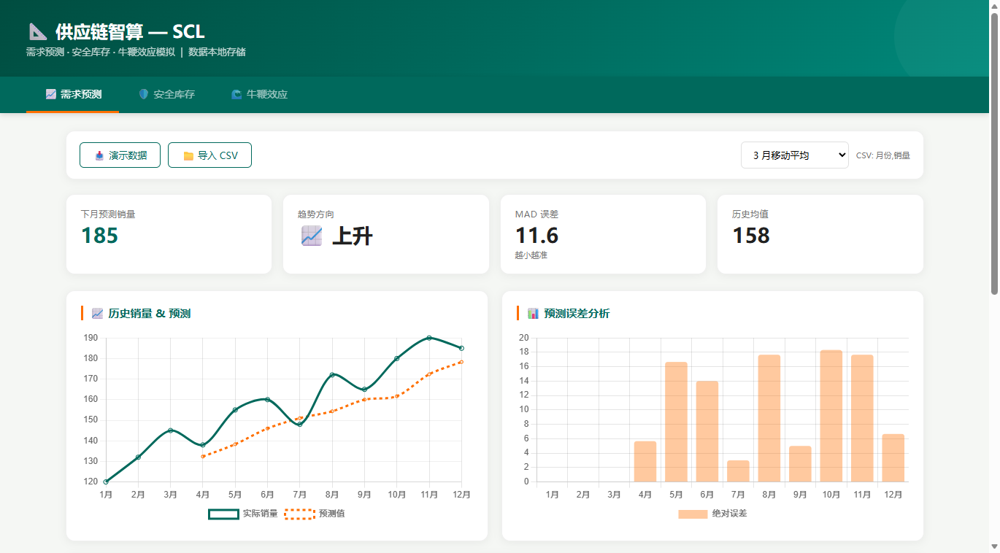
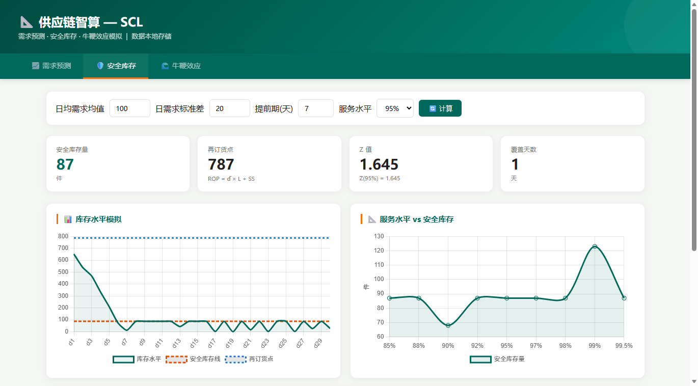
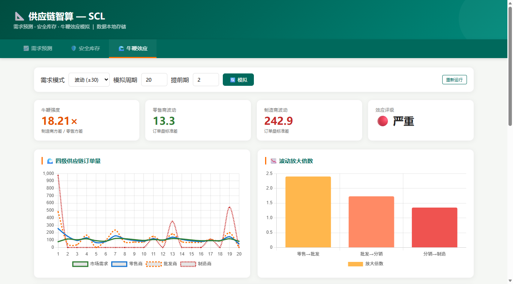

# 📐 SCL — 供应链智算工具

<p align="center">
  <b>需求预测 · 安全库存 · 牛鞭效应模拟</b><br>
  供应链管理三件套，数据本地存储，开箱即用
</p>

<p align="center">
  
  
  
  
</p>

---

## 🎯 一句话说清楚

**需求预测、安全库存计算、牛鞭效应模拟 — 供应链管理三大核心问题，一个页面搞定。**

---

## 📸 界面预览

<p align="center">
  
  
  
</p>

---

## 🚀 立即体验

| 入口 | 地址 |
|------|------|
| ⭐ **GitHub Pages** | [jinli-ping.github.io/SupplyChainLab](https://jinli-ping.github.io/SupplyChainLab) |
| 🌐 **PythonAnywhere** | [jinli.pythonanywhere.com/supply](https://jinli.pythonanywhere.com/supply) |
| 📂 **离线版** | 下载 `index.html` 双击打开 |

---

## 🧩 三大模块

### 📈 需求预测

- 三种方法：3月移动平均 / 5月移动平均 / 指数平滑 (α=0.3)
- 自动计算 MAD 误差和下月预测值
- 趋势方向判断（上升/平稳/下降）
- 📥 CSV 导入 / 📤 CSV 导出
- 折线图对比实际 vs 预测 + 误差柱状图

### 🛡️ 安全库存

- 公式：**SS = Z × σ × √L**（经典安全库存模型）
- 可调参数：日均需求、需求波动、提前期、服务水平
- 自动计算：安全库存量、再订货点、Z 值、覆盖天数
- 30 天库存动态模拟（随机波动）
- 服务水平 vs 库存成本权衡曲线

### 🌊 牛鞭效应

- 四级供应链模拟：零售商 → 批发商 → 分销商 → 制造商
- 三种需求模式：恒定 / 波动 / 突发尖峰
- 逐级订单量追踪 + 波动放大倍数可视化
- 牛鞭强度评级（🟢轻微 / 🟡中等 / 🔴严重）

---

## 💾 数据持久化

需求预测数据保存在浏览器 localStorage，关了再开不丢失。

---

## 🏗️ 技术栈

| 技术 | 用途 |
|------|------|
| HTML5 + CSS3 | 页面结构 |
| Chart.js 4.4 | 折线图、柱状图 |
| localStorage | 数据持久化 |
| JavaScript | 全部计算逻辑（移动平均、指数平滑、安全库存公式、供应链模拟） |

---

## 📁 项目结构

```
SupplyChainLab/
├── index.html            # 完整应用（单文件，可直接打开）
├── 启动SCL.bat            # Windows 一键启动
├── README.md
├── docs/                 # 截图
└── .gitignore
```

---

## 🔗 相关项目

| 工具 | 定位 | 链接 |
|------|------|------|
| **LogiOps** | 物流运营小助手 — 订单分析 · 库存预警 · 供应商评分 | [GitHub](https://github.com/jinli-ping/LogisticsOps) |
| **ALRSAT** | AI 物流企业风险自评工具 | [GitHub](https://github.com/jinli-ping/ALRSAT) |

三个工具互补，覆盖「计划 → 执行 → 风控」完整供应链链路。

---

## ⭐ 支持项目

如果对你有用，给个 Star ⭐ 就是最好的鼓励。

**作者：** [jinli-ping](https://github.com/jinli-ping) · 湖北第二师范学院 · 经济与管理学院 · 物流管理

---

## 📄 License

MIT © 2026 湖北第二师范学院经济与管理学院
